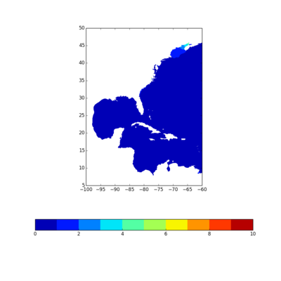
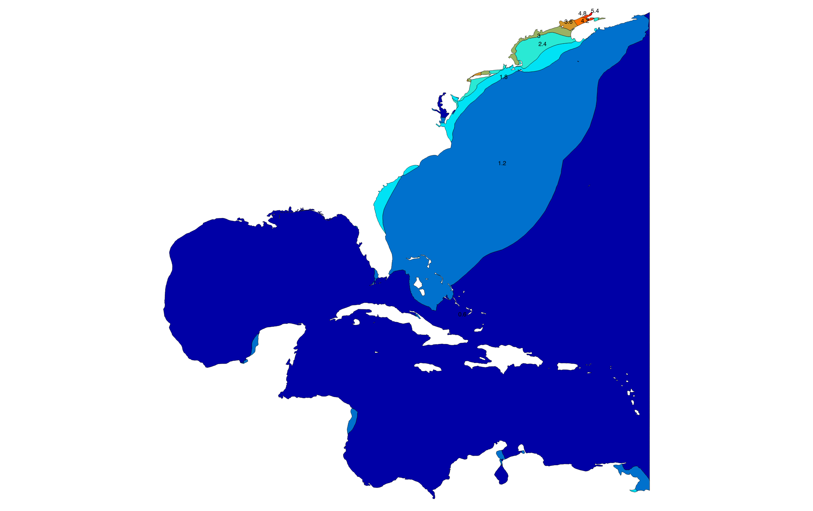

ugrid2shp
===============================

This python code computes GIS shapefiles from a CF-UGRID compliant netCDF file.  The contours are generated in matplotlib, and output using Shapely and Fiona.

###System Requirements
- Python 2.7.x
- Shapely 
    - https://pypi.python.org/pypi/Shapely/1.3.0
- Fiona (Geospatial Data Abstraction Library (GDAL) OGR interface
    - https://pypi.python.org/pypi/Fiona
- libcurl 
    - OPeNDAP dependency. 
    - http://curl.haxx.se/libcurl/
- libhdf5 C library 
    - Dependency for NetCDF4.
    - http://www.hdfgroup.org/HDF5/release/obtain5.html
    - See notes section if installing on a mac - there is an easier way.
- netCDF4 C library 
    - http://www.unidata.ucar.edu/downloads/netcdf/index.jsp
    - See notes section if installing on a mac - there is an easier way.
- netcdf4-python 
    - The netCDF4/libhdf5 C libraries must be installed before installing netcdf4-python.
    - https://pypi.python.org/pypi/netCDF4
- shell-doctest 
    - This python library is needed to run doc tests.
    - https://code.google.com/p/shell-doctest/
    - Install with `pip install https://pypi.python.org/packages/source/s/shelldoctest/shelldoctest-0.2.tar.gz#md5=94090432329f8db0fc5a3227bd2dfde9`

###Notes: 
On a mac using the homebrew package manager (http://brew.sh/), the homebrew/science tap (https://github.com/Homebrew/homebrew-science) can be used to simplify installation of the HDF5 and netCDF4 C libraries needed for building netcdf4-python. 
After installing homebrew, add the homebrew-science tap, then install the HDF5 and netCDF4 C libraries from the homebrew-science tap

###Usage:

ugrid2shp.py -h -d -s -w -x -z -n \<NcFileName|url\> -o \<OutFile\> -v \<NcVariableName\> -a \<MinVal\> -b \<MaxVal\> -c \<NumLevels\> -l \<AxisLims\> -p \<ProjectionString\>
		
	where:	-h | --Help				the text you are looking at right now
			-d | --Debug				display debugging diagnostics [False]
			-s | --Silent				no screen diagnostic output [True]
			-w | --WriteImage			write matplotlib image to a file <outfile>.png [False]
			-x | --ShowImage			display matplotlib image, user must close before continuing [False]
			-z | --NoZip				no zip file output [False]
			-n | --NcFileName	<ncfilename> 	netCDF file to read from, or a URL to an OPeNDAP file [maxele.63.nc]
			-o | --OutFile		<outfilename> 	filename to write shapefile to [outShape]
			-v | --NcVarName	<NcVarName> 	netCDF variable name to render [zeta_max]
			-a | --MinVal		<min value> 	smallest scalar value to render [0]
			-b | --MaxVal		<max value> 	largest scalar value to render [10]
			-c | --NumLevels	<num levels> 	number of contour levels [11]
			-l | --AxisLims		<[x0 y0 x1 y1]> axis limits to clip to [full domain]
			-p | --ProjStr				Projection string for prj file;  see below.
 
	A projection file (prj) is written containing the following:
		GEOGCS["GCS_WGS_1984",DATUM["D_WGS_1984",SPHEROID["WGS_1984",6378137.0,298.257223563]],PRIMEM["Greenwich",0.0],UNIT["Degree",0.0174532925199433]]
	To specify a different projection string, pass in -p | --ProjStr <projstr>, where projstr is as in this example:
		--ProjStr 'GEOGCS["GCS_WGS_1984",DATUM["D_WGS_1984",SPHEROID["WGS_1984",6378137.0,298.257223563]],PRIMEM["Greenwich",0.0],UNIT["Degree",0.0174532925199433]]' 

###Example usage:

    $ Define url=http://opendap.renci.org:1935/thredds/dodsC/ASGS/nam/2013112112/ec95d/hatteras.renci.org/cfsamp/namforecast/maxele.63.nc 
    $ Run silently (-s) pointing to the url devined above (-n $url), and with the maximum scalar value set to 6 (-b 6) 
    $ python ugrid2shp.py -s -n $url -b 6
    $ The first image is the matplotlib figure.  The second is the shapefile in QGIS.  the colormaps are not the same, but the contour lines are in the same locations.

###Test URLs:
	Coarse resolution ADCIRC grid: 
 		http://opendap.renci.org:1935/thredds/dodsC/ASGS/nam/2013112112/ec95d/hatteras.renci.org/cfsamp/namforecast/maxele.63.nc
 	Medium resolution ADCIRC grid: 
 		http://opendap.renci.org:1935/thredds/dodsC/ASGS/andrea/08/nc6b/blueridge.renci.org/fivemem/nhcConsensus/maxele.63.nc

